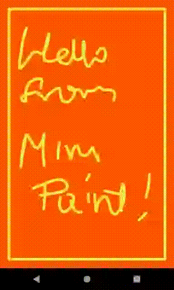

# Mini Paint Canvas 🖌️

Project created for the Udacity nanodegree Android Kotlin Developer program.

## Key Features ✨

- Custom Canvas View
- Draw on screen
- Touch Events
- Storage

## Project Milestones

- Create Custom Canvas View Class
- Override onSizeChanged()
- Override onDraw()
- Setup Paint for Drawing
- Initialize a Path Object
- Touch Events
- Implement
    - touchStart()
    - touchMove()
    - touchUp()
- Storage

## Overview

